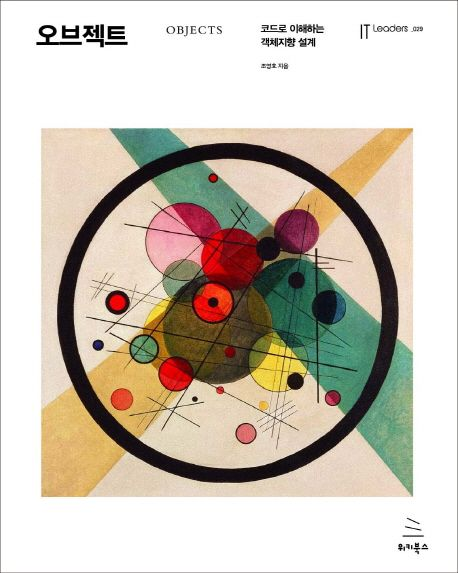

 

  

  <h3 align="center">오브젝트 스터디</h3>

  

    <a href="https://product.kyobobook.co.kr/detail/S000001766367" target="_blank">오브젝트 (저자 조영호)</a>를 읽고, 여러 언어로 구현해보며 객체지향 설계를 공부합니다.
  

## Introduction

> 본 스터디는 [김상효](https://github.com/SH0123)의 권유로 시작되었습니다. 스터디 목적은 객체 지향적 관점을 체득하는 것이며, 좀 더 깔끔한 코드를 작성하기 위함입니다. 해당 스터디가 마무리될 시점엔 SOLID 원칙을 최대한 지키는 코드를 작성할 수 있기를 바랍니다. 또한 개인적인 바람으로는 _"왜 C++은 SOLID한 코드를 작성하기 어려울까"_ 에 대한 답을 얻을 수 있었으면 좋겠습니다. - 이현민

  <a href="#readme-top">맨위로 ⬆</a>

## Roadmap

본 스터디는 여러 회차의 모임으로 구성됩니다. 각 회차마다 반복되는 스터디 프로세스는 다음과 같습니다.

1. 한 챕터를 읽고, 책에 나온 코드를 여러 언어로 작성합니다.
2. 해당 챕터에서 부족한 점을 파악하고, 더 개선된 코드를 작성합니다.
3. 느낀 점을 **한줄**로 요약합니다.

챕터1부터 챕터15까지 총 15번의 모임을 가지며, 총 15번의 모임 이후 본 스터디는 마무리됩니다.

  <a href="#readme-top">맨위로 ⬆</a>

## Attendance

| 챕터 | 제목       | 날짜            | 참여자 | 언어  |
| ---- | ---------- | --------------- | ------ | ----- |
| 1    | 객체, 설계 | 2023-11-13 (월) | 이현민 | C++   |
| 1    | 객체, 설계 | 2023-11-13 (월) | 김상효 | Swift |
|      |            |                 | 김기환 | C++   |

  <a href="#readme-top">맨위로 ⬆</a>

## License

MIT 라이선스 하에 배포됩니다. 자세한 내용은 [`LICENSE.txt`](./LICENSE.txt) 참고 바랍니다.

> [!NOTE]
> 오브젝트 책의 코드를 그대로 사용하지는 않았습니다. 하지만 해당 책에서 나온 내용과 이미지를 활용하기 때문에, 문제가 될 여지는 존재합니다. 혹시 문제가 있다면, 하단의 메일로 연락 부탁드립니다.

  <a href="#readme-top">맨위로 ⬆</a>

## Contact

- 이현민: 4725hmc@gmail.com

  <a href="#readme-top">맨위로 ⬆</a>

