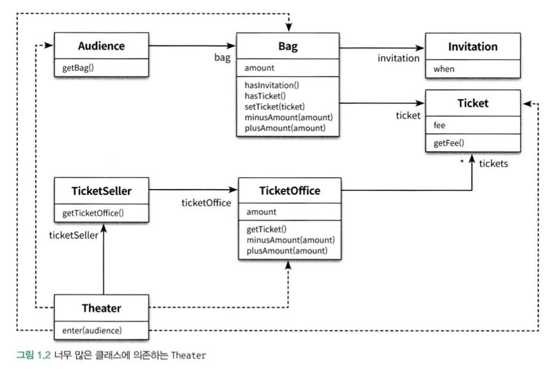

# Chapter01: 객체, 설계

</img>

본 챕터의 목표는 위와 같은 클래스 관계를 기본으로 티켓 판매 애플리케이션을 구현하는 것입니다. 저는 C++ 언어를 기반으로 코드를 작성하였습니다.


## 1. 책 코드 작성 with C++
### 01-01 <a href="./01-01/README.md">▶️</a>
> - 01 티켓 판매 애플리케이션 구현하기 (p.9~14)
> - 02 무엇이 문제인가 (p.14~17)

</img>

#### 문제점
- `Theater` 클래스는 너무 많은 클래스에 의존하고 있습니다.
- `Theater::enter` 함수는 현실 세계와 너무 다른 로직을 갖고 있습니다.

### 01-03 <a href="./01-03/README.md">▶️</a>
> - 03 설계 개선하기 (p.17~34)
> - 04 객체 지향 설계 (p.34~36)

</img>

#### 문제점
- C++ 에서 객체 할당이 어렵기 때문에, 메모리 누수가 발생하고 있습니다.
- 객체가 다른 객체에 의존하고 있기 때문에, 확장성이 좋지 않습니다.


## 2. 개선된 코드 작성: 메모리 누수 해결
### 01-reference <a href="./01-reference/README.md">▶️</a>
객체 내의 **필드**와 **레퍼런스**를 활용하여, 객체를 동적할당 하는 것이 아닌 복사하도록 하였습니다.
#### 기존 코드
```c++
class Bag {
 private:
  long amount;
  Invitation *invitation;
  Ticket *ticket;
  ...
};
```
#### 변경 코드
```c++
class Bag {
 private:
  long amount;
  std::optional<Invitation> invitation;
  std::optional<Ticket> ticket;
  ...
};
```
#### 문제점
- 하나의 객체가 여러 객체로 복사되기 때문에, 동기화 문제가 발생합니다.
- 여러개의 복사된 객체가 존재하기 때문에, 코드가 예상과 다르게 진행됩니다.
- `main::Theater::ticketSeller`와 `main::ticketSeller`는 다른 객체이므로, 데코레이터 패턴이 강제됩니다.

### 01-smart-pointer <a href="./01-smart-pointer/README.md">▶️</a>
**스마트 포인터**를 활용하여, 참조하지 않는 객체를 **자동으로 회수**하도록 하였습니다.
#### 기존 코드
```c++
class Bag {
 private:
  long amount;
  Invitation *invitation;
  Ticket *ticket;
  ...
};
```
#### 변경 코드
```c++
class Bag {
 private:
  long amount;
  std::unique_ptr<Invitation> invitation;
  std::unique_ptr<Ticket> ticket;
  ...
};
```
#### 문제점
- 특정 객체가 한 곳에서만 의존하는지, 여러 곳에서 의존하는지 미리 파악해야 합니다.
- 복사 생성자가 제한되기 때문에, 개발 속도가 느려집니다.

## 3. 느낀점 한줄
> 모든 모듈은 제대로 실행되어야 하고, 변경이 용이해야 하며, 이해하기 쉬워야 합니다.