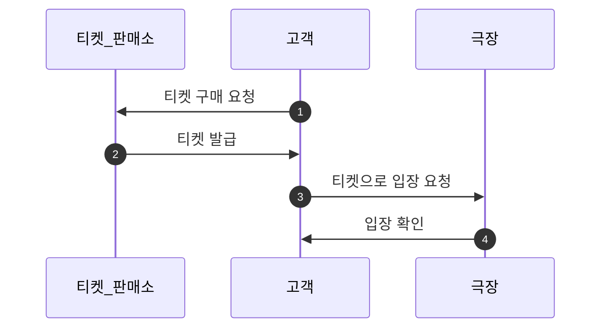

### 들어가기 전

- 패러다임(paradigm)은 특정 학문, 분야, 또는 시스템에서 특정한 시각이나 접근 방식
- 그중 프로그래밍 패러다임은, 프로그래밍에서 쓰일수 있는 유용한 방법론들의 모음이라고 생각함
- 객체지향 패러다임, 함수형 패러다임, 절차형 패러다임등 다양한 패러다임을 배우고 이를 적용하는게 가장 좋은듯
    - 실제로 객체지향 패러다임에, 함수형을 적절하게 섞어 더욱 가독성 있고 이해하기 쉬운 코드를 짤수 있는 것 처럼!

### 티켓 판매 어플리케이션 구현

기존 설계 방식 

- 커플링이 굉장히 심한 구조
- Theater(클래스)외에 다른 세가지 클래스가 데이터만 갖고 있는 형태
    - 절차 지향적 방식이라는 말은 이해하지 못했으나, 결국 클래스의 ㅛ책임이 한쪽에 집중된 구조
    - 캡슐화없이 Theater가 클래스의 모든 데이터 구조 및 함수를 알고 있는 구조

개선 설계 방식

- 각 클래스별 책임 분리
    - 사용자
        - 사용자는 금액등 데이터를 가짐
        - 해당 데이터를 통해 티켓판매소, 극장등에 메세지를 통해 필요한 동작을 요청
    - 티켓 판매소
        - 금액을 요청받으면, 필요한 티켓을 전달
    - 극장
        - 티켓을 받으면, 영화관에 입장시킴
- 티켓 판매소 ↔ 극장간 의존성 분리

### 결론

- 클래스를 생성할 때, 한 클래스에 책임이 너무 많아선 안됨
- 커플링이 심한 구조에서는 변경에 취약함
