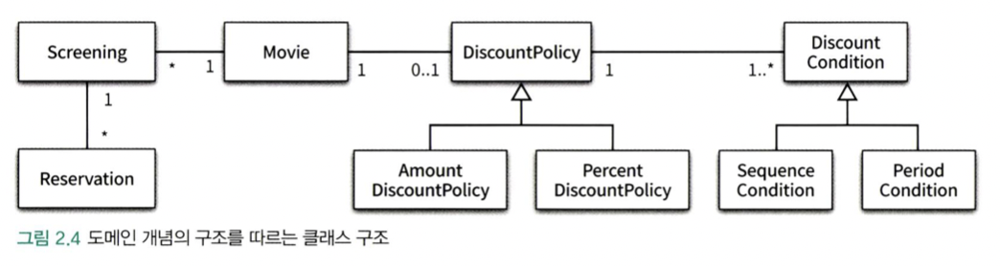
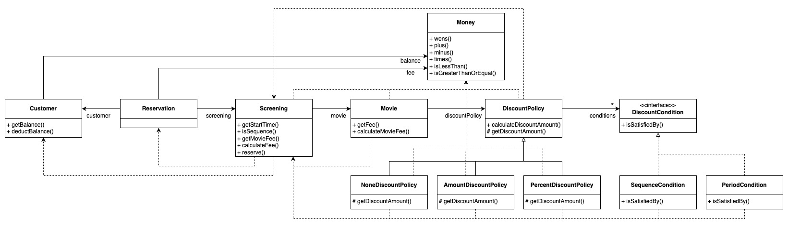

# Chapter02: 객체지향 프로그래밍

</img>

본 챕터의 목표는 위와 같은 클래스 관계를 기반으로 영화 예매 시스템을 구현하는 것입니다. 저는 C++ 언어를 기반으로 코드를 작성하였습니다.

## 1. 책 코드 분석 with C++

> - 01 영화 예매 시스템 (p.37~40)
> - 02 객체지향 프로그래밍을 향해 (p.40~49)
> - 03 할인 요금 구하기 (p.49~56)
> - 04 상속과 다형성 (p.57~65)
> - 05 추상화와 유연성 (p.65~72)

</img>

#### 문제점

- 대부분의 클래스에서 `Screening` 클래스에 의존하고 있으며, 의존 관계에 순환이 존재합니다.
- 순환 의존 관계 때문에, c++에서 class forward declaration이 필요합니다.
- 순환 의존 관계 때문에, 객체가 자신의 shared pointer wrapper에 접근할 수 있어야 합니다.
- 클라이언트에서 shared pointer가 아닌 객체를 임의로 생성할 위험이 있습니다.

#### shared pointer의 대표적인 문제

- Cyclic dependency

  순환 참조시, 객체가 해제되지 않을 수 있습니다. 하지만 본 챕터에서 겪은 문제는 아닙니다.

  https://stackoverflow.com/questions/22185896/what-is-the-cyclic-dependency-issue-with-shared-ptr

- Dangling pointer

  객체의 메소드에서 자신의 shared pointer에 접근해야 할 때 발생할 수 있는 문제입니다. 본 챕터에서 경험한 문제입니다.

  https://stackoverflow.com/questions/712279/what-is-the-usefulness-of-enable-shared-from-this

## 2. 코드 작성 with C++

### 문제 해결

- `Screening.fwd.hh` 헤더파일을 두어, class forward declaration을 하였습니다.
- Dangling pointer는 `std::enable_shared_from_this` 와 `shared_from_this` 로 해결하였습니다.
- 클라이언트에서의 임의적 객체 생성을 막기 위해, 생성자 대신 factory function만을 사용하여 객체를 생성할 수 있도록 하였습니다.

### 코드 실행
#### 1. 빌드
```sh
make
```
#### 2. 테스트 실행
```sh
./bin/run.exe
```
#### 3. 메모리 누수 체크
##### MacOS 환경
```sh
leaks --atExit -- ./run.exe
```
##### 결과: 메모리 누수 X
```
leaks Report Version: 4.0
Process 46292: 235 nodes malloced for 37 KB
Process 46292: 0 leaks for 0 total leaked bytes.
```

## 3. 느낀점 한줄

> C++에서의 객체 지향은 너무 멀고도 멀다.
